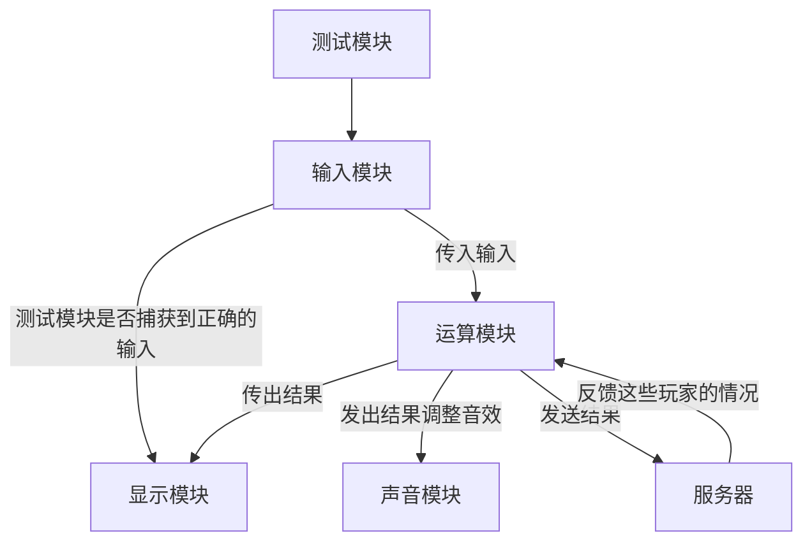
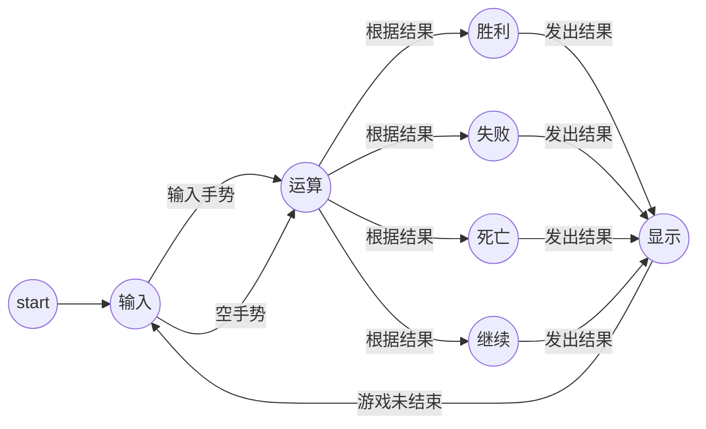

# 模块设计

## 输入模块

我们可以规定手指滑动的方向为小羊运动的方向，需要调用传感器来捕捉手势

所以这里我们需要对手势进行规定，单一的手势，复杂的手势，捕捉的时长等等

## 运算模块

这是最重要的功能，需要计算小羊的运动方向，保留之前已经圈得的地，结合游戏规则，将所有玩家的地进行判断给出游戏继续或者停止的结果

我觉得这里最重要的是如何保证这些玩家的运行情况的发送同步，以及良好的设计圈到的地的数据结构

## 显示模块

控制动画的播放，进行底层渲染

## 声音模块

游戏过程中播放音乐，圈到地，胜利或死亡时加声音特效

## 测试模块

这个模块的作用是用来规范化输入，完善游戏规则和显示效果，理论上可以和三个模块的进行交互

## 说明

除了测试模块，其余模块都是实时运行的,输入模块就类似中断的功能

# 游戏运行状态图

# 问题

语言统一

变量统一

模块间通信

模块与服务器通信